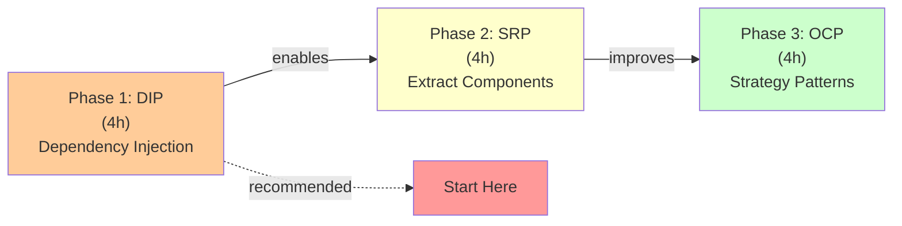

# SOLID Analysis - Executive Summary

## Overview

Your Local RAG system shows **good foundational design** with strong type safety, but has significant opportunities for improvement in code organization and dependency management architecture.

**Overall Score: 6.2/10**

---

## Quick Assessment

| Principle | Score | Status | Priority |
|-----------|-------|--------|----------|
| **SRP** (Single Responsibility) | 5/10 | ❌ **Violated** | HIGH |
| **OCP** (Open/Closed) | 5/10 | ❌ **Violated** | HIGH |
| **LSP** (Liskov Substitution) | 9/10 | ✅ **Good** | N/A |
| **ISP** (Interface Segregation) | 7/10 | ⚠️ **Acceptable** | MEDIUM |
| **DIP** (Dependency Inversion) | 4/10 | ❌ **Violated** | CRITICAL |

---

## Critical Findings (Must Fix)

### 🔴 #1: DIP - Hard Dependencies in main.ts
**Impact:** Cannot test, cannot switch LLM providers, cannot extend  
**Effort:** 4 hours | **Benefit:** Very High

### 🔴 #2: SRP - main() has 8+ responsibilities
**Impact:** Impossible to maintain, test, or reuse components  
**Effort:** 3 hours | **Benefit:** Very High

### 🔴 #3: OCP - Switch statement for document loaders
**Impact:** Adding new file format requires code modification  
**Effort:** 2 hours | **Benefit:** High

---

## Key Issues by Severity

### Critical (Breaks SOLID fundamentally)
1. **main.ts** imports and uses concrete Ollama, readline, InMemoryHistory directly
2. **main() function** has 8 different change reasons (SRP violation)
3. **vector.ts getRetriever()** mixes 7+ concerns (SRP violation)
4. **documentLoader.ts** uses switch for file types (OCP violation)

### High (Major maintainability impact)
1. **ConfigService** mixes env vars, file I/O, validation, defaults
2. **config.ts** requires modification for new config sections (OCP)
3. **vector.ts** depends directly on OllamaEmbeddings (DIP)

### Medium (Improvement opportunity)
1. **AppConfig** interface forces depending on full config
2. **validation.ts** mixes different validation concerns
3. **validateFilePath** and **sanitizeQuestion** are not abstracted

---

## What's Working Well ✅

1. **Type Safety:** Excellent interface design in types.ts
2. **Security:** Good validation and sanitization functions
3. **Error Handling:** Clear error messages and try-catch blocks
4. **LSP Compliance:** PatchedChroma properly extends Chroma
5. **Documentation:** Clear comments explaining intent

---

## Where Code is Fragile 🚨

| Area | Problem | Risk |
|------|---------|------|
| **Switching LLM** | Direct Ollama import in main.ts | HIGH - Requires major rewrite |
| **Adding file format** | Switch statement in loadDocuments() | MEDIUM - Requires code edit |
| **New config section** | Hardcoded in getConfig() | MEDIUM - Requires code edit |
| **Testing** | Cannot inject mocks | CRITICAL - Hard to test |
| **Reusability** | main() logic is entangled | HIGH - Cannot reuse components |

---

## Refactoring Roadmap

### 🚀 Quick Wins (Do First - 2 hours)
1. Extract document loaders to strategy pattern
2. See immediate OCP benefit for file format support
3. Minimal risk, clear improvement

### 🏗️ Foundation Work (Medium - 4 hours)
1. Refactor ConfigService into composed parts
2. Extract SRP violations
3. Better separation of concerns

### 🎯 Major Refactor (Long-term - 6 hours)
1. Add dependency injection to main.ts
2. Create abstraction layer for services
3. Full SOLID compliance

**Total Effort:** ~12 hours spread over 3 phases

---

## Three-Phase Implementation Plan



### Phase 1: Dependency Injection (DIP) - 4 hours
- Create service abstractions
- Build dependency factory
- Refactor main.ts to use injection
- **Benefit:** Enables testing, switching providers

### Phase 2: Service Decomposition (SRP) - 4 hours
- Extract config loading
- Break down main() responsibilities
- Create focused service classes
- **Benefit:** Better maintainability, testability

### Phase 3: Strategy Patterns (OCP) - 4 hours
- Refactor document loaders
- Create loading registry
- Support new formats without code changes
- **Benefit:** Extensibility

---

## Code Quality Metrics

### Before Refactoring
```
Cyclomatic Complexity:
  main(): 12-15          ❌ Too high (should be < 5)
  getRetriever(): 8-10   ❌ Too high (should be < 5)
  getConfig(): 7-8       ❌ Moderate

Number of Responsibilities:
  main(): 8              ❌ Should be 1
  ConfigService: 5       ❌ Should be 1
  getRetriever(): 7      ❌ Should be 1

Test Coverage:
  main(): 0%             ❌ Not testable
  Isolated functions: ~60%
```

### After Refactoring (Target)
```
Cyclomatic Complexity:
  main(): 2-3            ✅ Simple orchestration
  Each service: 2-4      ✅ Focused
  Validators: 2-3        ✅ Simple

Number of Responsibilities:
  main(): 1              ✅ Orchestration only
  Each service: 1        ✅ Single concern
  Each validator: 1      ✅ Single concern

Test Coverage:
  All components: 80%+   ✅ Fully testable
  main(): 70-80%         ✅ Easy to test via DI
```

---

## Specific Recommendations

### For main.ts (Critical)
```typescript
// ❌ BEFORE: Concrete dependencies
const model = new Ollama(config.ollama);
const messageHistory = new InMemoryChatMessageHistory();
const rl = readline.createInterface({...});

// ✅ AFTER: Dependency injection
const appConfig = await factory.createConfig();
// Now uses abstractions, can swap implementations
```

### For documentLoader.ts (High)
```typescript
// ❌ BEFORE: Hardcoded switch
switch (fileType) {
  case "csv": return loadCsv(filePath);
  case "pdf": return await loadPdf(filePath);
  // Adding .txt requires code modification
}

// ✅ AFTER: Registry pattern
const loader = registry.getLoader(fileType);
// Adding .txt: just register new loader, zero code changes
```

### For ConfigService (High)
```typescript
// ❌ BEFORE: Monolithic class
class ConfigService {
  getConfig(): AppConfig {
    // Handles env vars, file I/O, validation, defaults
    // 50+ lines of mixed concerns
  }
}

// ✅ AFTER: Composed builders
class AppConfigBuilder {
  constructor(
    envProvider: EnvVarProvider,
    jsonProvider: JsonConfigProvider
  ) {}
  build(): AppConfig {
    // 20 lines, delegates to validators
  }
}
```

---

## Testing Strategy

After refactoring, you can test components like:

```typescript
// ✅ Test validators in isolation
const validator = new DefaultInputValidator();
expect(validator.validate("test")).toEqual({ valid: true });

// ✅ Test services with mock LLM
const mockModel = { invoke: async () => "test response" };
const app = new RagApplication({...config, model: mockModel});

// ✅ Test loaders without knowing implementation
const pdf = new PdfDocumentLoader();
const docs = await pdf.load("test.pdf");
expect(docs.length).toBeGreaterThan(0);

// ✅ Test config builders with test data
const builder = new AppConfigBuilder(
  new TestEnvVarProvider(),
  new TestJsonProvider()
);
const config = builder.build();
```

---

## Migration Strategy

**Don't rewrite everything at once.** Use this approach:

1. **Keep existing code working**
2. **Add new abstractions alongside**
3. **Gradually migrate to new code**
4. **Remove old code once all tests pass**

```typescript
// Step 1: Add abstraction
interface ILanguageModel { /* ... */ }

// Step 2: Create implementation
class OllamaLanguageModel implements ILanguageModel { /* ... */ }

// Step 3: Use in parallel
async function main() {
  // Option A: Old way (temporary)
  const oldModel = new Ollama(...);
  
  // Option B: New way (new code)
  const factory = new RagServiceFactory(...);
  const newModel = factory.createLanguageModel();
}

// Step 4: Switch all calls to new way, remove old

// Step 5: Delete old code
```

---

## Files to Create/Modify

### New Files (Refactoring Implementation)
```
src/
├── abstractions/
│   └── interfaces.ts                    (NEW) Service interfaces
├── services/
│   ├── OllamaLanguageModel.ts          (NEW) LLM implementation
│   ├── InMemoryMessageHistoryProvider.ts (NEW) History mgmt
│   ├── DefaultInputValidator.ts        (NEW) Validation
│   ├── DefaultInputSanitizer.ts        (NEW) Sanitization
│   └── ReadlineUserInputHandler.ts     (NEW) User input
├── factories/
│   ├── RagServiceFactory.ts            (NEW) Service creation
│   └── DocumentLoaderFactory.ts        (NEW) Loader registry
├── loaders/
│   ├── DocumentLoaderStrategy.ts       (NEW) Strategy interface
│   └── strategies/
│       ├── CsvDocumentLoader.ts        (NEW)
│       ├── PdfDocumentLoader.ts        (NEW)
│       └── DocxDocumentLoader.ts       (NEW)
└── config/
    ├── providers/
    │   ├── EnvVarProvider.ts           (NEW)
    │   └── JsonConfigProvider.ts       (NEW)
    └── validators/
        └── OllamaConfigValidator.ts    (NEW)
```

### Files to Modify
```
src/
├── main.ts                  (REFACTOR) Use DI factory
├── config.ts                (REFACTOR) Use builder composition
├── vector.ts                (REFACTOR) Extract retriever factory
├── loaders/
│   └── documentLoader.ts    (REFACTOR) Use strategy pattern
└── types.ts                 (MINOR) Add ISP interfaces
```

---

## Success Metrics

After refactoring, you should see:

1. ✅ **main.ts under 50 lines** (currently ~143)
2. ✅ **ConfigService under 40 lines** (currently ~217)
3. ✅ **No hardcoded class instantiations** in main (currently 5+)
4. ✅ **New file formats supported without code changes**
5. ✅ **80%+ unit test coverage** (currently low/untestable)
6. ✅ **Cyclomatic complexity < 5 for all functions** (currently 8-15)

---

## Related Documentation

1. **[SOLID_ANALYSIS.md](./SOLID_ANALYSIS.md)** - Detailed principle-by-principle analysis
2. **[SOLID_REFACTORING_GUIDE.md](./SOLID_REFACTORING_GUIDE.md)** - Concrete code implementations

---

## Questions to Ask When Reviewing

Before starting refactoring, answer:

1. **DIP:** How would you change to OpenAI? (Should be: swap factory)
2. **SRP:** Can you unit test main() standalone? (Should be: yes)
3. **OCP:** Can you add .txt support? (Should be: just register loader)
4. **ISP:** Does addConfig need full AppConfig? (Should be: only relevant parts)
5. **LSP:** Can you swap implementations? (Should be: via interfaces)

---

## Conclusion

Your codebase demonstrates **solid TypeScript skills** with excellent type safety. The main opportunity is **architectural refactoring** to better separate concerns, enable testing, and support extensibility.

The good news: **Fixing these issues is straightforward** with clear patterns (DI, Strategy, Builder) and the fixes are high-impact on code quality.

**Recommended Start:** Begin with **Phase 1 (DIP refactoring in main.ts)**. It's high-impact, enables testing, and makes the rest easier.

